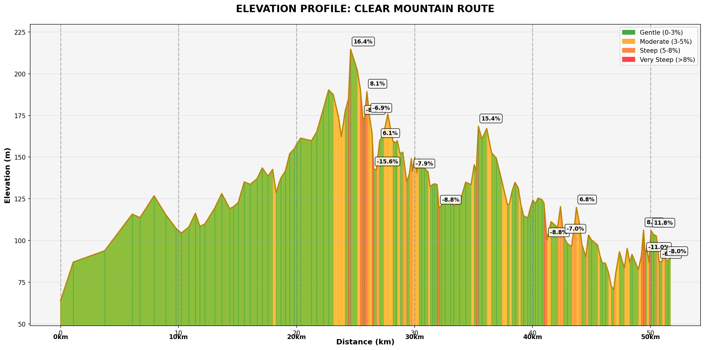

# Elevation Profiler - Tour de France Style

Create professional Tour de France style elevation profiles from your cycling routes using Google Earth KML files.


## Features

- 🏔️ **Tour de France Style Profiles**: Professional elevation charts with gradient color coding
- 📊 **Comprehensive Statistics**: Distance, elevation gain/loss, gradients, and steepest sections
- 🗺️ **Dual Route Support**: Works with both route paths (LineString) and round-trip areas (Polygon)
- 🌍 **Real Elevation Data**: Uses Google Elevation API with realistic fallback data
- 📱 **Modern Interface**: Bootstrap-based responsive design

## Example Output

Here's what your elevation profiles will look like - professional Tour de France style visualization with gradient color coding:



*Example: 51.66km route with 624.7m elevation gain, showing gradient colors from gentle (green) to very steep (red) sections with distance markers and gradient labels*

## Quick Start

### 1. Prerequisites

- Python 3.7+
- Node.js 14+
- Google Elevation API Key (optional but recommended)

### 2. Installation

```bash
# Clone or download the project
cd elevation-profiler

# Install backend dependencies
cd backend
pip install -r requirements.txt

# Install frontend dependencies
cd ../frontend
npm install
```

### 3. Setup Google Elevation API (Optional)

1. Go to [Google Cloud Console](https://console.cloud.google.com/)
2. Create a new project or select existing one
3. Enable the "Elevation API"
4. Create credentials (API Key)
5. Set environment variable:

**Windows:**
```cmd
set GOOGLE_ELEVATION_API_KEY=your_api_key_here
```

**Mac/Linux:**
```bash
export GOOGLE_ELEVATION_API_KEY=your_api_key_here
```

### 4. Run the Application

**Start Backend:**
```bash
cd backend
python main.py
```
Backend will run on http://localhost:8000

**Start Frontend:**
```bash
cd frontend
npm start
```
Frontend will run on http://localhost:3000

## Creating KML Files with Google Earth

### Method 1: Route Paths (LineString)

1. **Open Google Earth Web**: Go to [earth.google.com](https://earth.google.com)
2. **Create New Project**: Click the menu (☰) → "Projects" → "New Project"
3. **Add Path**: Click "New Feature" → "Draw line or shape"
4. **Draw Your Route**: 
   - Click along your desired cycling route
   - Follow roads, trails, or create custom paths
   - Double-click to finish the path
5. **Name Your Route**: Give it a descriptive name (e.g., "Mountain Loop Ride")
6. **Save and Export**: 
   - Save your project
   - Click the menu → "Export as KML file"

### Method 2: Round-Trip Areas (Polygon)

1. **Follow steps 1-2 above**
2. **Add Shape**: Click "New Feature" → "Draw line or shape"
3. **Draw Area**: 
   - Click to create a polygon around your desired cycling area
   - The app will convert this to a sequential route
   - Close the polygon by clicking the first point
4. **Name Your Area**: Give it a descriptive name (e.g., "Lake Circuit Area")
5. **Save and Export**: Same as Method 1

### Tips for Better Routes

- **Follow Roads**: Stick to actual roads and cycling paths for realistic profiles
- **Appropriate Detail**: Don't make routes too complex - 50-200 points work well
- **Multiple Routes**: You can include multiple routes in one KML file
- **Descriptive Names**: Use clear names to identify routes easily

## Using the Elevation Profiler

1. **Upload KML File**: Select your exported KML file
2. **Choose Route**: Select from available routes in the dropdown
3. **Generate Profile**: Click "Generate Elevation Profile"
4. **View Results**: 
   - Professional elevation chart with gradient colors
   - 8 key statistics including distance, elevation gain, steepest sections
   - Tour de France style visualization

## Understanding the Visualization

### Gradient Color Coding
- 🟢 **Green (0-3%)**: Gentle slopes, easy riding
- 🟡 **Yellow (3-5%)**: Moderate climbs, steady effort
- 🟠 **Orange (5-8%)**: Steep climbs, challenging sections  
- 🔴 **Red (>8%)**: Very steep, maximum effort required

### Statistics Explained
- **Total Distance**: Complete route length in kilometers
- **Elevation Gain/Loss**: Total meters climbed and descended
- **Max/Min Elevation**: Highest and lowest points on route
- **Steepest Climb/Descent**: Maximum gradient percentages
- **Average Gradient**: Overall route gradient

## Troubleshooting

### Common Issues

**"net::ERR_CONNECTION_REFUSED"**
- Ensure backend server is running on port 8000
- Check that both frontend and backend are started
- Restart backend server if you made code changes

**"No routes found in KML file"**
- Ensure your KML contains either LineString (paths) or Polygon (areas)
- Check that routes have names in Google Earth
- Verify KML file exported correctly from Google Earth

**Elevation data seems unrealistic**
- Set up Google Elevation API key for real data
- Without API key, app uses simulated Brisbane-area topography
- Check that your route coordinates are valid

### API Limits
- Google Elevation API: 2,500 free requests per day
- For high usage, consider Google Cloud billing
- App automatically falls back to simulated data if API fails

## File Structure

```
elevation-profiler/
├── backend/
│   ├── main.py              # FastAPI backend server
│   └── requirements.txt     # Python dependencies
├── frontend/
│   ├── src/App.js          # React frontend application
│   ├── package.json        # Node.js dependencies
│   └── public/             # Static files
├── test_backend.py         # Backend testing script
├── Bike routes.kml         # Sample KML file
└── README.md              # This file
```

## Technical Details

- **Backend**: FastAPI with CORS support, Google Elevation API integration
- **Frontend**: React with Bootstrap, Axios for API calls
- **Visualization**: Matplotlib with Tour de France styling
- **Geospatial**: GeoPy for distance calculations, XML parsing for KML

## Contributing

Feel free to submit issues, feature requests, or pull requests to improve the elevation profiler!

## License

This project is open source and available under the MIT License.

---

**Happy Cycling! 🚴‍♂️🏔️**

Create your routes in Google Earth, upload the KML, and get professional Tour de France style elevation profiles for your cycling adventures!
